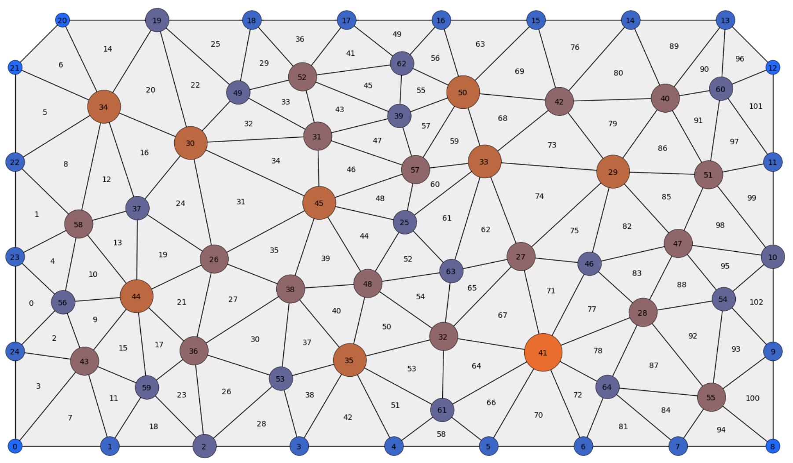
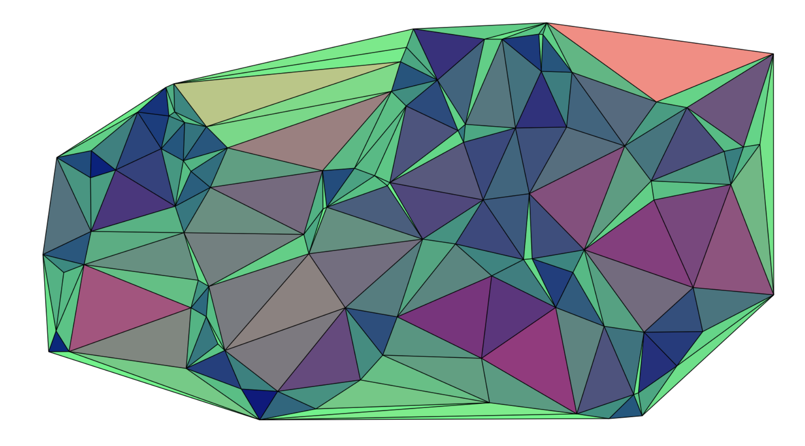
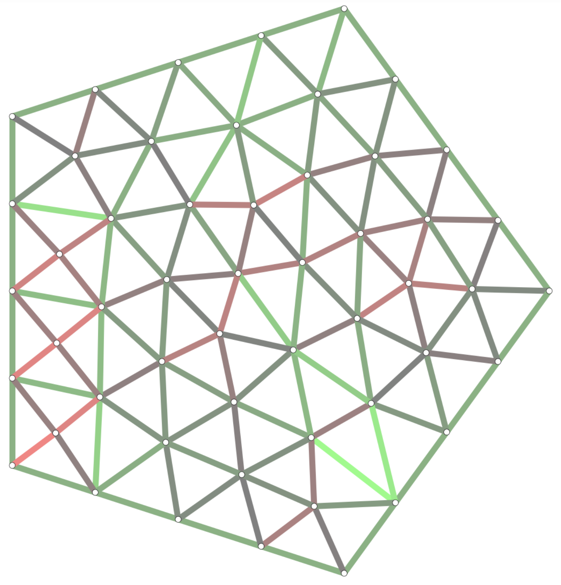

# Introduction to COMPAS

COMPAS is not a library or a plugin, but an open source, python-based framework for computational research and collaboration in architecture, engineering, fabrication and construction (AEFC). It provides a core library with data structures, algorithms, utilities and visualisation tools for AEFC applications; packages for interaction with or integration in CAD software; project templates; an easy-to-use ecosystem for the development of extensions; transparent integration of 3rd party libraries; and much more...

[compas-dev.github.io/](https://compas-dev.github.io/)

## 1. Mesh Basics

[nb](190926_compas_mesh.ipynb)

**Topics covered:** creation of a mesh from scratch, import mesh from obj file, export mesh, label nodes and faces, analyse node degree, color and radius of nodes dependent on node degree

## 2. Mesh Dual

[nb](190927_1_mesh_dual.ipynb)

**Topics covered:** two different approaches on how to calculate the mesh dual, one custom implementation, one using [compas: mesh_dual](https://compas-dev.github.io/main/api/generated/compas.datastructures.mesh_dual.html)

## 3. Analysis

[nb](190927_2_color_by_area.ipynb)

**Topics covered:** two different ways to generate a mesh from a set of points using [compas: delaunay_from_points](https://compas-dev.github.io/main/api/generated/compas.geometry.delaunay_from_points.html), analyse different mesh face properties like area and skewness and color the faces accordingly (red: area, green: skewness)

## 4. Remeshing

[nb](190927_3_edge-length.ipynb)

**Topics covered:** remeshing a coarse input mesh into approximately equilateral triangles using [compas: trimesh_remesh](https://compas-dev.github.io/main/api/generated/compas.datastructures.trimesh_remesh.html), analyse edge lengths and color them from red (too short) to green (too long)
