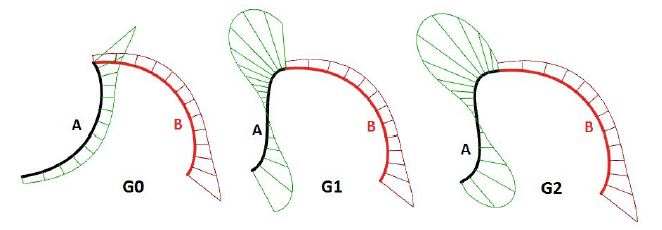
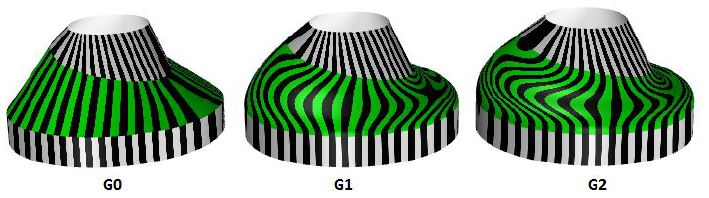

[<< Back to index](index.md)

# 00. conceptual

## Curves and Surface continuity

* curves control points and curves edit points. 
* curve degrees and Curvature graph
* G0 position continuous, G1 Tangent continuous, G2 Curvature continuous 

* surfaces u,v 
* Zebra Analysis
* G0 position continuous, G1 Tangent continuous, G2 Curvature continuous 

## References

* [Rhino Level 2 Training Guide and Models](https://www.rhino3d.com/download/rhino/5.0/Rhino5Level2Training/) , focus on chapter 3, 4 and 5
* [Essential Mathematics for Computational Design (4th Edition)](https://www.rhino3d.com/download/rhino/6/essentialmathematics)

[<< Back to index](index.md)
