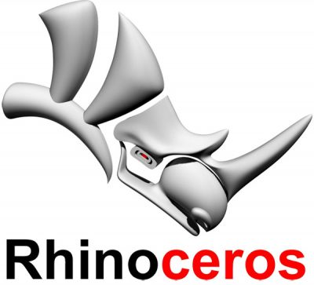

[<< Back to index](index.md)

# 1. Rhino basics

## Introduction

Training guide for Rhino 6 or later

Rhinoceros, is a 3D CAD modeling software package that enables you to accurately model your designs ready for rendering, animation, drafting, engineering, analysis, and manufacturing. Rhino is a free-form NURBS surface modeler.

[<< Back to index](index.md)
