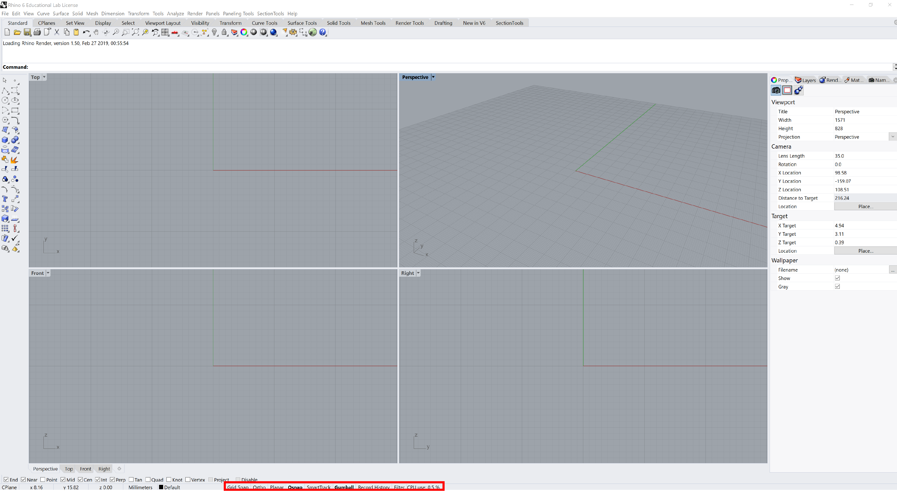
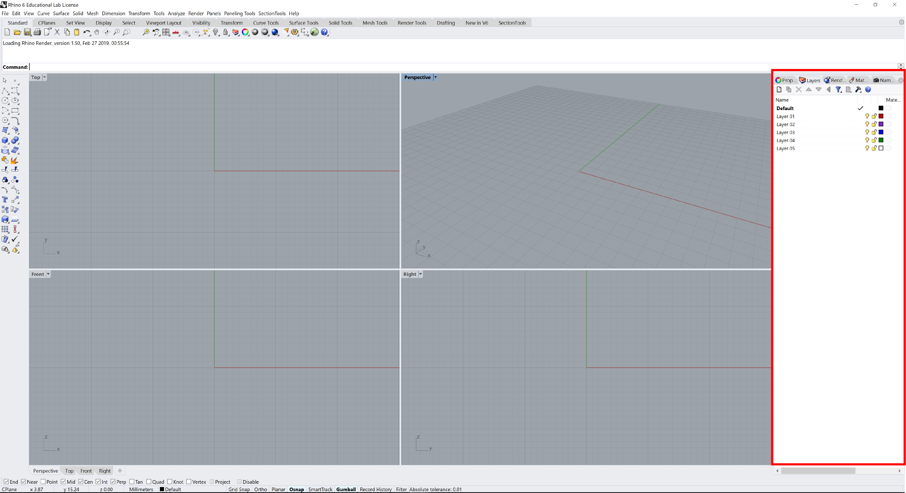

[<< Back to index](index.md)

# 3. Modeling Helpers

## Modeling Aids

### Grid Snap
Snap to grid intersections
	
### Ortho
Constrains the marker movement to the points at a specified angle from the last point created
		
### Planar
This helps you model planar objects by constraining the input to be on a plane parallel to the construction plane
	
### Osnap
Object snaps constrain the marker to an exact location on an object
	
### SmartTrack
Temporary reference lines and points that are drawn in the Rhino viewport
	
### Gumball
Display widget, on a selected object, facilitating move, scale, and rotate transformations
	
### Record History
Records history and updates history-aware objects
	
### Filter
Restricts any selection mode to specified object types

## Layers
By creating objects on different layers, you can edit and view related portions of a model separately or as a composite.

	  
[<< Back to index](index.md)
