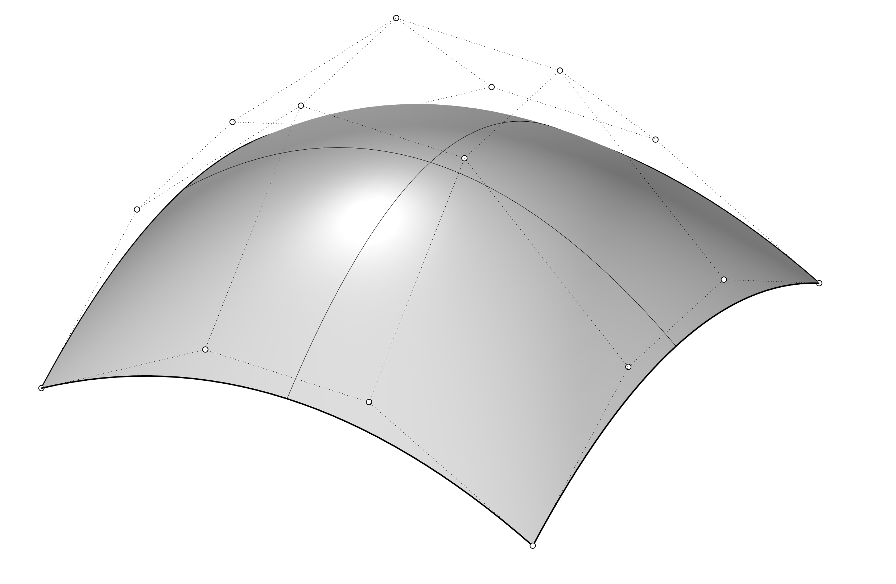

[<< Back to index](index.md)

# 5. Point editing

You can display the control points or the edit points of an object so that you can adjust the shape of an object, rather than manipulating the whole object at once.

## Control points
Control points do not have to be on the curve or surface.

## Edit points
Edit points are always on the curve or surface.

## Knots
Knots are parameters (that is, numbers, not points).

[<< Back to index](index.md)
