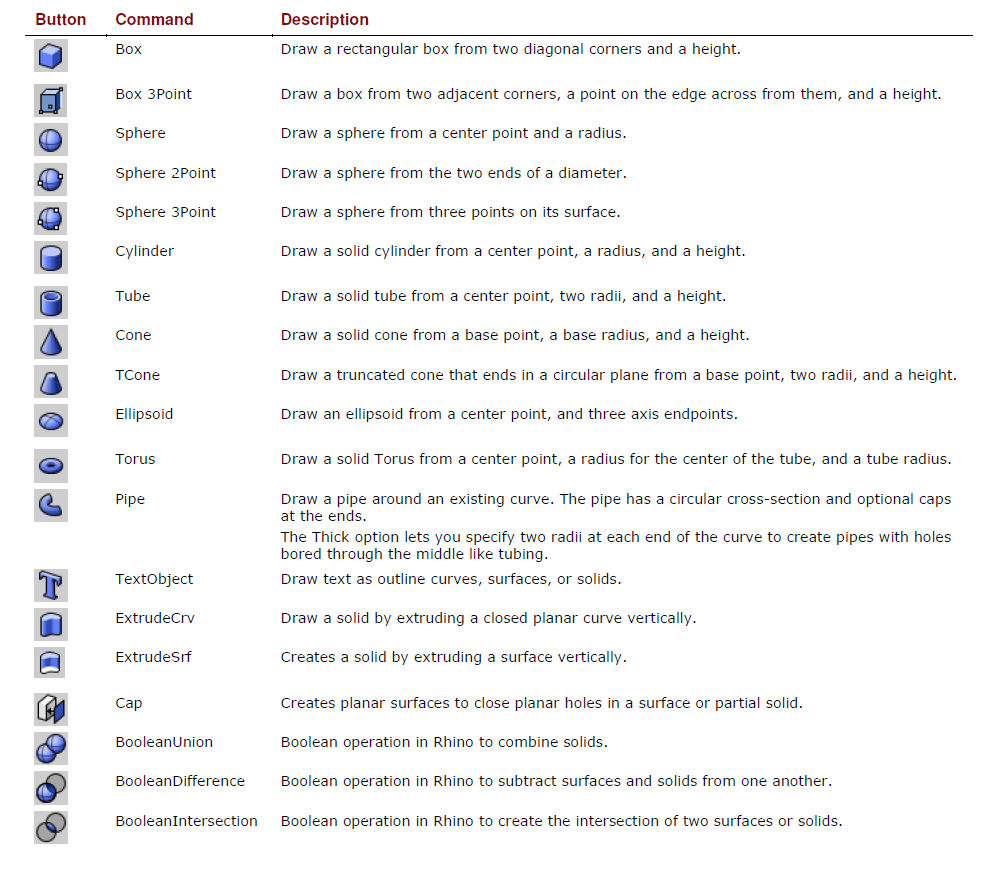

[<< Back to index](index.md)

# 6. Solid Modelling

Solids are closed surfaces or polysurfaces that enclose a volume.

Some of the solid primitives are closed single-surfaces, others are polysurfaces.

Polysurface objects are deformable by using the deformation commands.

You can also extract surfaces and deform the surfaces with control point editing.

[<< Back to index](index.md)
