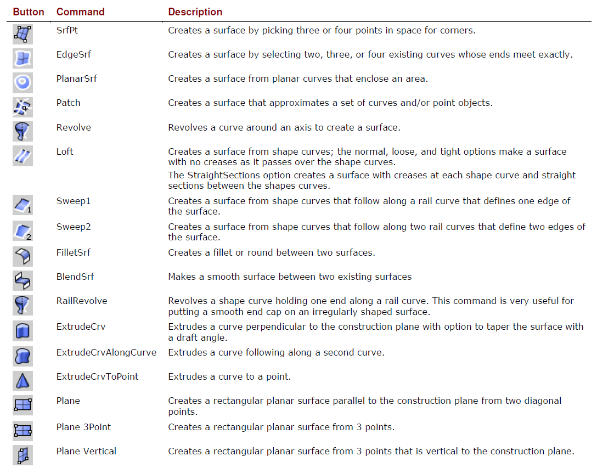

[<< Back to index](index.md)

# 7. Surfaces
Surfaces are bounded by curves called edges.

Surfaces have an area, their shape can be changed by moving control points, and they can be meshed.

[<< Back to index](index.md)
