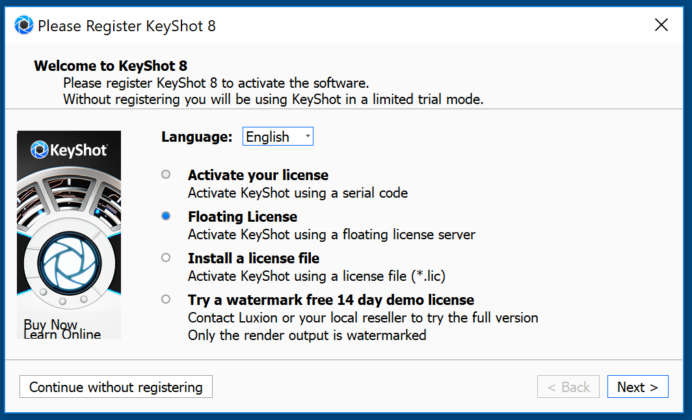

# Install Party

## Programming
* [Sourcetree Git](https://confluence.atlassian.com/get-started-with-sourcetree/install-sourcetree-847359094.html) *
* [Anaconda Python 3.7](https://www.anaconda.com/distribution/#download-section) *
* [Visual Studio Code](https://code.visualstudio.com) *
* [compas core](https://compas-dev.github.io/main/gettingstarted/installation.html) *
* [compas_fab](https://gramaziokohler.github.io/compas_fab/latest/getting_started.html)

## CAD and Rendering
* [Rhino](https://www.rhino3d.com/download) *
* KeyShot
To install, go to https://www.keyshot.com/resources/downloads/ and pick the installer for your OS. Then during installation, choose “Floating License” in this window:

and when prompted for the license server, enter keyshot.arch.ethz.ch
You need to be online (and in the ETH network, or VPN) to launch the software. There are 20 floating licenses to check out.

## Communication
* [Slack](https://slack.com/), also in app stores for your OS *

## Mesh Editing
* [MeshLab](http://www.meshlab.net)
* [MeshMixer](http://www.meshmixer.com)

## Thymio
* [Aesba Studio for Thymio](https://www.thymio.org/program/aseba/) *

## Reference Management
* [Mendeley](https://www.mendeley.com/)
* [Zotero](https://www.zotero.org/)
